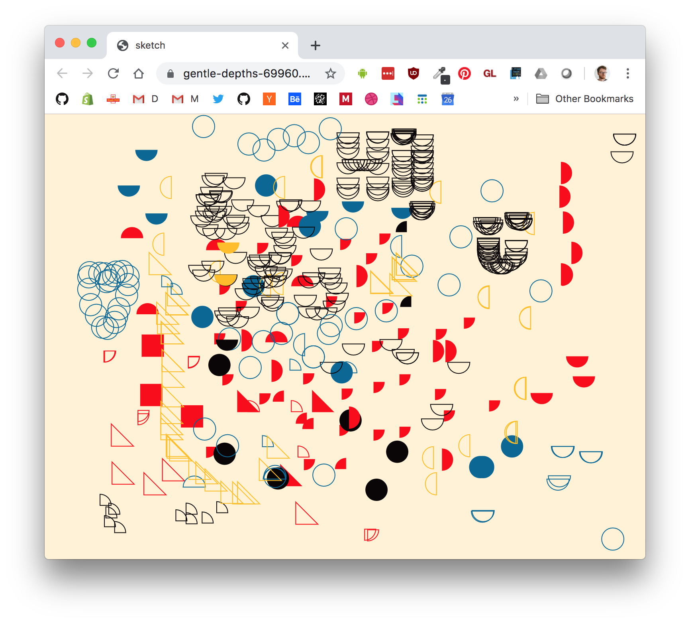

# euclid-space

A collaborative shape drawing app with colours inspired by [Oliver Byrne's edition of Euclid](https://www.math.ubc.ca/~cass/Euclid/byrne.html).

When a user joins, they are assigned a random shape and colour which they can place around the document.

Play it here:

https://gentle-depths-69960.herokuapp.com/



# tools

- [p5.js](https://p5js.org) for drawing
- [socket.io](https://socket.io/) for networking

# running locally

To run it locally, first clone and install dependencies:

```sh
git clone https://github.com/mattdesl/euclid-space.git

cd euclid-space

npm install
```

Then you can run the server to start the app:

```sh
npm run start
```

Then open [http://localhost:3000/](http://localhost:3000/) in a few different browser tabs and click around to see the different shapes.